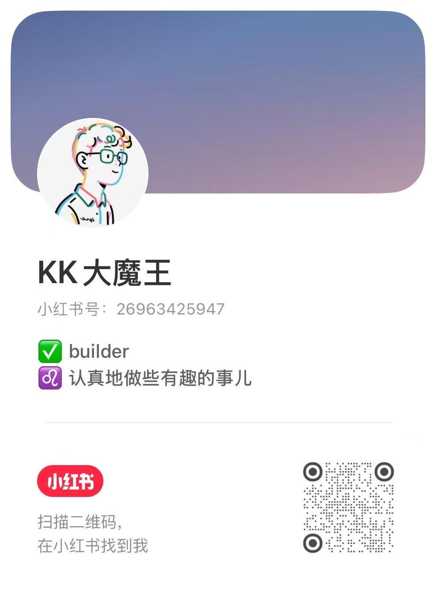

### Hi, I'm Daniel 👋

I'm a builder working on AI agents and the infrastructure around them.

I'm based in Shenzhen, China, and occasionally in Shanghai.

- 🔭 I'm currently building [Open Dynamic Workflows](https://github.com/xz1220/open-dynamic-workflows)—a practical runtime and workflow system for AI coding agents. It makes Claude Code-style dynamic workflows portable across Codex, Claude Code, Gemini, Qwen, Kimi, and other coding-agent CLIs.

- 🧭 I'm exploring multi-agent systems, AI products, and knowledge work—especially how to make agent systems reliable enough for solo builders to use in production.

[Website](https://xz1220.github.io/) · [X / Twitter](https://x.com/DanielsCabin) · [Email](mailto:danielxing1@163.com) · [Zhihu](https://www.zhihu.com/people/xz1220) · [Xiaohongshu](https://www.xiaohongshu.com/user/profile/655488ff00000000080023a0) · WeChat: `Xingzheng-daniel`

  
  &nbsp;&nbsp;
  

